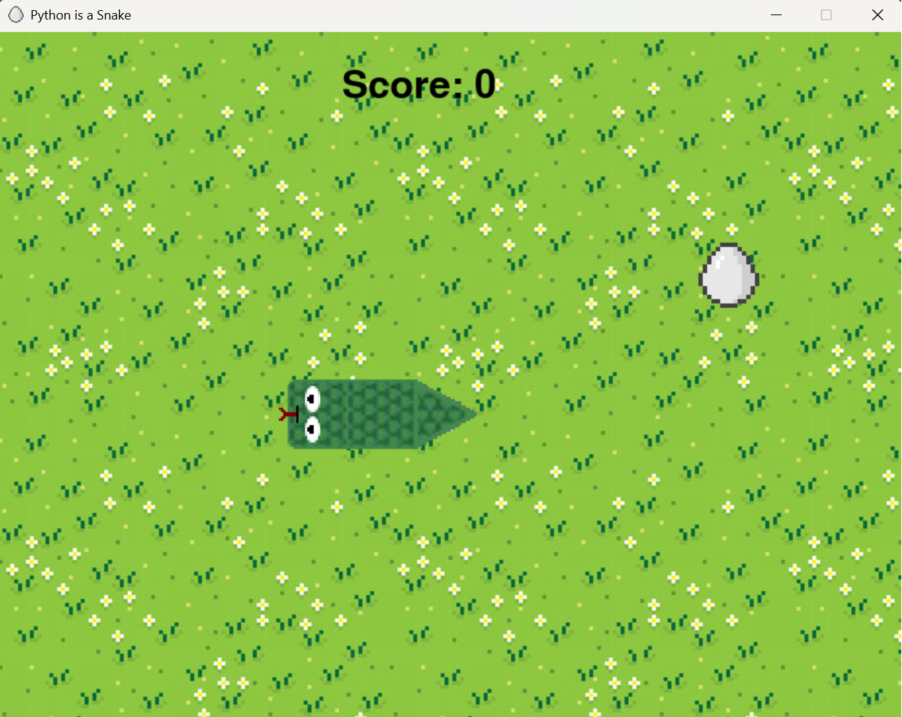

# Python Snake Game

Questo progetto è un'implementazione del classico gioco Snake in Python utilizzando la libreria Pygame.

## Descrizione

Il gioco Snake è un videogioco in cui il giocatore controlla un serpente che si muove all'interno di un'area di gioco. L'obiettivo è mangiare il cibo che appare casualmente sullo schermo, facendo crescere il serpente. Il gioco termina se il serpente si scontra con se stesso.

## Screenshot



## Requisiti

- Python 3.x
- Pygame

## Installazione

1. Clona questo repository:
    ```bash
    git clone https://github.com/tuo-username/python_snake.git
    ```
2. Naviga nella directory del progetto:
    ```bash
    cd python_snake
    ```
3. Installa le dipendenze richieste:
    ```bash
    pip install pygame
    ```

## Utilizzo

Per avviare il gioco, esegui il seguente comando:
```bash
python main.py
```